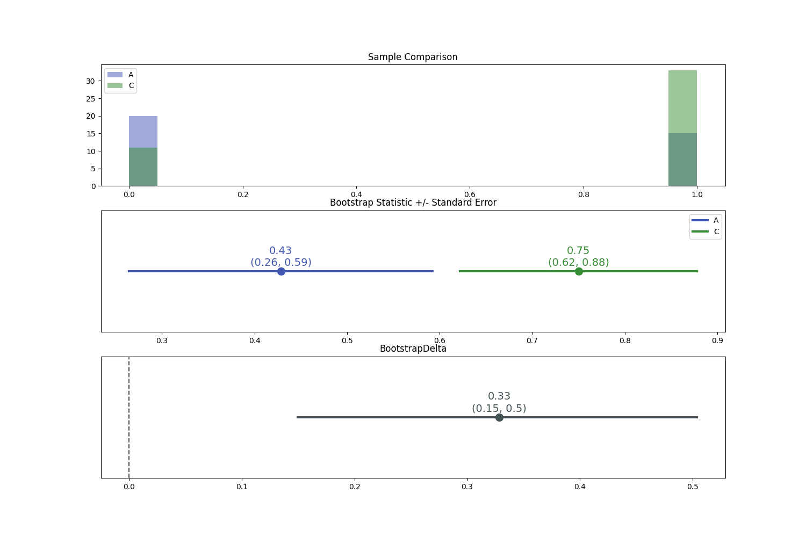

# ✨ABracadabra✨

[](https://circleci.com/gh/quizlet/abracadabra)


✨ABracadabra✨ is a Python framework consisting of statistical tools and a convenient API specialized for running hypothesis tests on observational experiments (aka “AB Tests” in the tech world). The framework has driven [Quizlet](https://quizlet.com)’s experimentation pipeline since 2018.

## Features
- Offers a simple and intuitive, yet powerful API for running, visualizing, and interpreting statistically-rigorous hypothesis tests with none of the hastle of jumping between various statistical or visualization packages.
- Supports most common variable types used in AB Tests inlcuding:
    + Continuous
    + Binary/Proportions
    + Counts/Rates
- Implements many Frequentist and Bayesian inference methods including:


| Variable Type | Model Class| `inference_method` parameter  |
|---|---|---|
| Continuous | Frequentist| `'means_delta'` (t-test) |
|  | Bayesian| `'gaussian'`, `'student_t'`, `'exp_student_t'`|
| Binary / Proportions | Frequentist| `'proportions_delta'` (z-test) |
|  | Bayesian| `'beta'`, `'beta_binomial'`, `'bernoulli'`  |
| Counts/Rates  |Frequentist| `'rates_ratio'`
|  |Bayesian| `'gamma_poisson'`  |
| Non-parametric  |Bootstrap| `'bootstrap'` |

- Supports multiple customizations:
    + Custom metric definitions
    + Bayesian priors
    + Easily extendable to support new inference methods


## Installation

### Requirements
- ✨ABracadabra✨ has been tested on `python>=3.7`.

### Install via `pip`
#### from the PyPI index (recommended)

```bash
pip install abracadabra
```

#### from Quizlet's Github repo

```bash
pip install git+https://github.com/quizlet/abracadabra.git
```

### Install from source
If you would like to contribute to ✨ABracadabra✨, then you'll probably want to install from source (or use the `-e` flag when installing from `PyPI`):

```bash
mkdir /PATH/TO/LOCAL/ABRACABARA && cd /PATH/TO/LOCAL/ABRACABARA
git clone git@github.com:quizlet/abracadabra.git
cd abracadabra
python setup.py develop
```

## ✨ABracadabra✨ Basics

### Observations data
✨ABracadabra✨ takes as input a [pandas](https://pandas.pydata.org/) `DataFrame` containing experiment observations data. Each record represents an observation/trial recorded in the experiment and has the following columns:

- **One or more `treatment` columns**: each treatment column contains two or more distinct, discrete values that are used to identify the different groups in the experiment
- **One or more `metric` columns**: these are the values associated with each observation that are used to compare groups in the experiment.
- **Zero or more `attributes` columns**: these are associated with additional properties assigned to the observations. These attributes can be used for any additional segmentations across groups.

To demonstrate, let's generate some artificial experiment observations data. The `metric` column in our dataset will be a series of binary outcomes (i.e. `True`/`False`, here stored as `float` values). This binary `metric` is analogous to *conversion* or *success* in AB testing. These outcomes are simulated from three different Bernoulli distributions, each associated with the `treatement`s named `"A"`, `"B"`, and `"C"`. and each of which has an increasing average probability of *conversion*, respectively. The simulated data also contains four `attribute` columns, named `attr_*`.

```python
from abra.utils import generate_fake_observations

# generate demo data
experiment_observations = generate_fake_observations(
    distribution='bernoulli',
    n_treatments=3,
    n_attributes=4,
    n_observations=120
)

experiment_observations.head()
"""
   id treatment attr_0 attr_1 attr_2 attr_3  metric
0   0         C    A0a    A1a    A2a    A3a     1.0
1   1         B    A0b    A1a    A2a    A3a     1.0
2   2         C    A0c    A1a    A2a    A3a     1.0
3   3         C    A0c    A1a    A2a    A3a     0.0
4   4         A    A0b    A1a    A2a    A3a     1.0
"""
```

### Running an AB test in ✨ABracadabra✨ is as easy as ✨123✨:

The three key components of running an AB test are:

- **The `Experiment`**, which references the observations recorded during experiment (described above) and any optional metadata associated with the experiment.
- **The `HypothesisTest`**, which defines the hypothesis and statistical inference method applied to the experiment data.
- **The `HypothesisTestResults`**, which is the statistical artifact that results from running a `HypothesisTest` against an `Experiment`'s observations. The `HypothesisTestResults` are used to summarize, visualize, and interpret the inference results and make decisions based on these results.

Thus running an hypothesiss test in ✨ABracadabra✨ follows the basic 123 pattern:

1. Initialize your `Experiment` with observations and (optionally) any associated metadata.
2. Define your `HypothesisTest`. This requires defining the `hypothesis` and a relevant `inference_method`, which will depend on the support of your observations.
3. Run the test against your experiment and interpret the resulting `HypothesisTestResults`

We now demonstrate how to run and analyze a hypothesis test on the artificial observations data generated above. Since this simulated experiment focuses on a binary `metric` we'll want our `HypothesisTest` to use an `inference_method` that supports binary variables. The `"proportions_delta"` inference method, which tests for a significant difference in average probability between two different samples of probabilities is a valid test for our needs. Here our probabilities equal either `0` or `1`, but the sample averages will likely be equal to some intermediate value. This is analogous to AB tests that aim to compare conversion rates between a control and a variation group.

In addition to the `inference_method`, we also want to establish the `hypothesis` we want to test. In other words, if we find a significant difference in conversion rates, do we expect one group to be larger or smaller than the other. In this test we'll test that the `variation` group `"C"`has a `"larger"` average conversion rate than the `control` group `"A"`.

Below we show how to run such a test in ✨ABracadabra✨.

```python
# Running an AB Test is as easy as 1, 2, 3
from abra import Experiment, HypothesisTest

# 1. Initialize the `Experiment`
# We (optionally) name the experiment "Demo"
exp = Experiment(data=experiment_observations, name='Demo')

# 2. Define the `HypothesisTest`
# Here, we test that the variation "C" is "larger" than the control "A",
# based on the values of the "metric" column, using a Frequentist z-test,
# as parameterized by `inference_method="proportions_delta"`
ab_test = HypothesisTest(
    metric='metric',
    treatment='treatment',
    control='A', variation='C',
    inference_method='proportions_delta',
    hypothesis='larger'
)

# 3. Run and interpret the `HypothesisTestResults`
# Here, we run our HypothesisTest with an assumed
# Type I error rate of alpha=0.05
ab_test_results = exp.run_test(ab_test, alpha=.05)
assert ab_test_results.accept_hypothesis

# Display results
ab_test_results.display()
"""
Observations Summary:
+----------------+------------------+------------------+
| Treatment      | A                | C                |
+----------------+------------------+------------------+
| Metric         | metric           | metric           |
| Observations   | 35               | 44               |
| Mean           | 0.4286           | 0.7500           |
| Standard Error | (0.2646, 0.5925) | (0.6221, 0.8779) |
| Variance       | 0.2449           | 0.1875           |
+----------------+------------------+------------------+

Test Results:
+---------------------------+---------------------+
| ProportionsDelta          | 0.3214              |
| ProportionsDelta CI       | (0.1473, inf)       |
| CI %-tiles                | (0.0500, inf)       |
| ProportionsDelta-relative | 75.00 %             |
| CI-relative               | (34.37, inf) %      |
| Effect Size               | 0.6967              |
| alpha                     | 0.0500              |
| Power                     | 0.9238              |
| Inference Method          | 'proportions_delta' |
| Test Statistic ('z')      | 3.4671              |
| p-value                   | 0.0003              |
| Degrees of Freedom        | None                |
| Hypothesis                | 'C is larger'       |
| Accept Hypothesis         | True                |
| MC Correction             | None                |
| Warnings                  | None                |
+---------------------------+---------------------+
"""

# Visualize Frequentist Test results
ab_test_results.visualize()
```


We see that the Hypothesis test declares that the variation `'C is larger'` (than the control `"A"`) showing a 43% relative increase in conversion rate, and a moderate effect size of 0.38. This results in a p-value of 0.028, which is lower than the prescribed $\alpha=0.05$.

## Bootstrap Hypothesis Tests

If your samples do not follow standard parametric distributions (e.g. Gaussian, Binomial, Poisson), or if you're comparing more exotic descriptive statistics (e.g. median, mode, etc) then you might want to consider using a non-parametric [Bootstrap Hypothesis Test](https://en.wikipedia.org/wiki/Bootstrapping_(statistics)).  Running bootstrap tests is easy in ✨abracadabra✨, you simply use the `"bootstrap"` `inference_method`.

```python
# Tests and data can be copied via the `.copy` method.
bootstrap_ab_test = ab_test.copy(inference_method='bootstrap')

# Run the Bootstrap test
bootstrap_ab_test_results = exp.run_test(bootstrap_ab_test)

# Display results
bootstrap_ab_test_results.display()

"""
Observations Summary:
+----------------+------------------+------------------+
| Treatment      | A                | C                |
+----------------+------------------+------------------+
| Metric         | metric           | metric           |
| Observations   | 35               | 44               |
| Mean           | 0.4286           | 0.7500           |
| Standard Error | (0.2646, 0.5925) | (0.6221, 0.8779) |
| Variance       | 0.2449           | 0.1875           |
+----------------+------------------+------------------+

Test Results:
+-----------------------------------------+-------------------+
| BootstrapDelta                          | 0.3285            |
| BootstrapDelta CI                       | (0.1497, 0.5039)  |
| CI %-tiles                              | (0.0500, inf)     |
| BootstrapDelta-relative                 | 76.65 %           |
| CI-relative                             | (34.94, 117.58) % |
| Effect Size                             | 0.7121            |
| alpha                                   | 0.0500            |
| Power                                   | 0.8950            |
| Inference Method                        | 'bootstrap'       |
| Test Statistic ('bootstrap-mean-delta') | 0.3285            |
| p-value                                 | 0.0020            |
| Degrees of Freedom                      | None              |
| Hypothesis                              | 'C is larger'     |
| Accept Hypothesis                       | True              |
| MC Correction                           | None              |
| Warnings                                | None              |
+-----------------------------------------+-------------------+
"""

## Visualize Bayesian AB test results, including samples from the model
bootstrap_ab_test_results.visualize()
```



Notice that the `"bootstrap"` hypothesis test results above--which are based on resampling the data set with replacent--are very similar to the results returned by the `"proportions_delta"` parametric model, which are based on descriptive statistics and model the data set as a Binomial distribution. The results will converge as the sample sizes grow.

## Bayesian AB Tests

Running Bayesian AB Tests is just as easy as running a Frequentist test, simply change the `inference_method` of the `HypothesisTest`. Here we run Bayesian hypothesis test that is analogous to `"proportions_delta"` used above for conversion rates. The Bayesian test is based on the [Beta-Binomial model](https://en.wikipedia.org/wiki/Beta-binomial_distribution), and thus called with the argument `inference_method="beta_binomial"`.

```python
# Copy the parameters of the original HypothesisTest,
# but update the `inference_method`
bayesian_ab_test = ab_test.copy(inference_method='beta_binomial')
bayesian_ab_test_results = exp.run_test(bayesian_ab_test)
assert bayesian_ab_test_results.accept_hypothesis

# Display results
bayesian_ab_test_results.display()
"""
Observations Summary:
+----------------+------------------+------------------+
| Treatment      | A                | C                |
+----------------+------------------+------------------+
| Metric         | metric           | metric           |
| Observations   | 35               | 44               |
| Mean           | 0.4286           | 0.7500           |
| Standard Error | (0.2646, 0.5925) | (0.6221, 0.8779) |
| Variance       | 0.2449           | 0.1875           |
+----------------+------------------+------------------+

Test Results:
+----------------------+-------------------------------+
| Delta                | 0.3028                        |
| HDI                  | (0.0965, 0.5041)              |
| HDI %-tiles          | (0.0500, 0.9500)              |
| Delta-relative       | 76.23 %                       |
| HDI-relative         | (7.12, 152.56) %              |
| Effect Size          | 0.6628                        |
| alpha                | 0.0500                        |
| Credible Mass        | 0.9500                        |
| p(C > A)             | 0.9978                        |
| Inference Method     | 'beta_binomial'               |
| Model Hyperarameters | {'alpha_': 1.0, 'beta_': 1.0} |
| Inference Method     | 'sample'                      |
| Hypothesis           | 'C is larger'                 |
| Accept Hypothesis    | True                          |
| Warnings             | None                          |
+----------------------+-------------------------------+
"""

# Visualize Bayesian AB test results, including samples from the model
bayesian_ab_test_results.visualize()
```


Above we see that the Bayesian hypothesis test provides similar results to the Frequentist test, indicating a 45% relative lift in conversion rate when comparing `"C"` to `"A"`. Rather than providing p-values that are used to accept or reject a Null hypothesis, the Bayesian tests provides directly-interpretable probability estimates `p(C > A) = 0.95`, here indicating that there is 95% chance that the `variation` `"C"` is larger than the `control` `"A"`.

## [Additional Documentation and Tutorials](https://github.com/quizlet/abracadabra/blob/master/docs)

## [CHANGELOG](./CHANGELOG.md)
